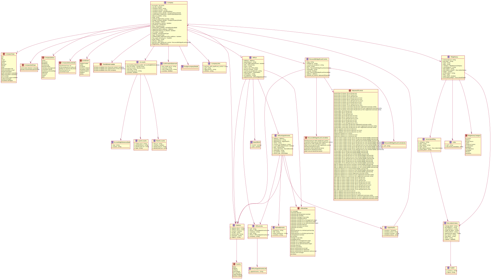

# Companies House Data Description

*Above diagram generated by [tplant](https://github.com/bafolts/tplant) commit version [67ceef6](https://github.com/bafolts/tplant/commit/67ceef69e2f9027270a022b985b24cee636dab25) based on the [typescript class file](./classes.ts) made by retriving data from API calls and converted to [Typescript classes](https://transform.tools/json-to-typescript).*

## Table of Contents

- [Companies House Data Description](#companies-house-data-description)
  - [Table of Contents](#table-of-contents)
  - [Endpoints \& Data Specifications](#endpoints--data-specifications)
    - [Company Profile](#company-profile)
    - [Officer List](#officer-list)
    - [Officer Appointments](#officer-appointments)
    - [Persons with Significant Control](#persons-with-significant-control)
    - [Filing History](#filing-history)

## Endpoints & Data Specifications

### Company Profile

- API Endpoint: https://api.company-information.service.gov.uk/company/{company_number}
- Data Specification: https://developer-specs.company-information.service.gov.uk/companies-house-public-data-api/resources/companyprofile?v=latest

| Name                                                                        | Type            | Description                                                                                                                                                                                                                                                                                                                                                                                                                                                                                                                                                                                                                                                                                                                                                                                                                                                                                                                                                                                                                                                                                                                                                                                                                                                                                                                                                                                                                                                         | Additional |
| --------------------------------------------------------------------------- | --------------- | ------------------------------------------------------------------------------------------------------------------------------------------------------------------------------------------------------------------------------------------------------------------------------------------------------------------------------------------------------------------------------------------------------------------------------------------------------------------------------------------------------------------------------------------------------------------------------------------------------------------------------------------------------------------------------------------------------------------------------------------------------------------------------------------------------------------------------------------------------------------------------------------------------------------------------------------------------------------------------------------------------------------------------------------------------------------------------------------------------------------------------------------------------------------------------------------------------------------------------------------------------------------------------------------------------------------------------------------------------------------------------------------------------------------------------------------------------------------- | ---------- |
| accounts                                                                    | object          | Company accounts information.                                                                                                                                                                                                                                                                                                                                                                                                                                                                                                                                                                                                                                                                                                                                                                                                                                                                                                                                                                                                                                                                                                                                                                                                                                                                                                                                                                                                                                       | Optional   |
| accounts.accounting_reference_date                                          | object          | The Accounting Reference Date (ARD) of the company.                                                                                                                                                                                                                                                                                                                                                                                                                                                                                                                                                                                                                                                                                                                                                                                                                                                                                                                                                                                                                                                                                                                                                                                                                                                                                                                                                                                                                 |            |
| accounts.accounting_reference_date.day                                      | integer         | The Accounting Reference Date (ARD) day.                                                                                                                                                                                                                                                                                                                                                                                                                                                                                                                                                                                                                                                                                                                                                                                                                                                                                                                                                                                                                                                                                                                                                                                                                                                                                                                                                                                                                            |            |
| accounts.accounting_reference_date.month                                    | integer         | The Accounting Reference Date (ARD) month.                                                                                                                                                                                                                                                                                                                                                                                                                                                                                                                                                                                                                                                                                                                                                                                                                                                                                                                                                                                                                                                                                                                                                                                                                                                                                                                                                                                                                          |            |
| accounts.last_accounts                                                      | object          | The last company accounts filed.                                                                                                                                                                                                                                                                                                                                                                                                                                                                                                                                                                                                                                                                                                                                                                                                                                                                                                                                                                                                                                                                                                                                                                                                                                                                                                                                                                                                                                    | Optional   |
| accounts.last_accounts.made_up_to                                           | date            | Deprecated. Please use accounts.last_accounts.period_end_on                                                                                                                                                                                                                                                                                                                                                                                                                                                                                                                                                                                                                                                                                                                                                                                                                                                                                                                                                                                                                                                                                                                                                                                                                                                                                                                                                                                                         |            |
| accounts.last_accounts.period_end_on                                        | date            | The last day of the most recently filed accounting period.                                                                                                                                                                                                                                                                                                                                                                                                                                                                                                                                                                                                                                                                                                                                                                                                                                                                                                                                                                                                                                                                                                                                                                                                                                                                                                                                                                                                          | Optional   |
| accounts.last_accounts.period_start_on                                      | date            | The first day of the most recently filed accounting period.                                                                                                                                                                                                                                                                                                                                                                                                                                                                                                                                                                                                                                                                                                                                                                                                                                                                                                                                                                                                                                                                                                                                                                                                                                                                                                                                                                                                         | Optional   |
| accounts.last_accounts.type                                                 | object          | The type of the last company accounts filed. For enumeration descriptions see account_type section in the enumeration mappings.            Possible values are:                      null                full                small                medium                group                dormant                interim                initial                total-exemption-full                total-exemption-small                partial-exemption                audit-exemption-subsidiary                filing-exemption-subsidiary                micro-entity                no-accounts-type-available                audited-abridged                unaudited-abridged                                                                                                                                                                                                                                                                                                                                                                                                                                                                                                                                                                                                                                                                                                                                                                           |            |
| accounts.next_accounts                                                      | object          | The next company accounts filed.                                                                                                                                                                                                                                                                                                                                                                                                                                                                                                                                                                                                                                                                                                                                                                                                                                                                                                                                                                                                                                                                                                                                                                                                                                                                                                                                                                                                                                    | Optional   |
| accounts.next_accounts.due_on                                               | date            | The date the next company accounts are due                                                                                                                                                                                                                                                                                                                                                                                                                                                                                                                                                                                                                                                                                                                                                                                                                                                                                                                                                                                                                                                                                                                                                                                                                                                                                                                                                                                                                          | Optional   |
| accounts.next_accounts.overdue                                              | boolean         | Flag indicating if the company accounts are overdue.                                                                                                                                                                                                                                                                                                                                                                                                                                                                                                                                                                                                                                                                                                                                                                                                                                                                                                                                                                                                                                                                                                                                                                                                                                                                                                                                                                                                                | Optional   |
| accounts.next_accounts.period_end_on                                        | date            | The last day of the next accounting period to be filed.                                                                                                                                                                                                                                                                                                                                                                                                                                                                                                                                                                                                                                                                                                                                                                                                                                                                                                                                                                                                                                                                                                                                                                                                                                                                                                                                                                                                             | Optional   |
| accounts.next_accounts.period_start_on                                      | date            | The first day of the next accounting period to be filed.                                                                                                                                                                                                                                                                                                                                                                                                                                                                                                                                                                                                                                                                                                                                                                                                                                                                                                                                                                                                                                                                                                                                                                                                                                                                                                                                                                                                            | Optional   |
| accounts.next_due                                                           | date            | Deprecated. Please use accounts.next_accounts.due_on                                                                                                                                                                                                                                                                                                                                                                                                                                                                                                                                                                                                                                                                                                                                                                                                                                                                                                                                                                                                                                                                                                                                                                                                                                                                                                                                                                                                                | Optional   |
| accounts.next_made_up_to                                                    | date            | Deprecated. Please use accounts.next_accounts.period_end_on                                                                                                                                                                                                                                                                                                                                                                                                                                                                                                                                                                                                                                                                                                                                                                                                                                                                                                                                                                                                                                                                                                                                                                                                                                                                                                                                                                                                         |            |
| accounts.overdue                                                            | boolean         | Deprecated. Please use accounts.next_accounts.overdue                                                                                                                                                                                                                                                                                                                                                                                                                                                                                                                                                                                                                                                                                                                                                                                                                                                                                                                                                                                                                                                                                                                                                                                                                                                                                                                                                                                                               |            |
| annual_return                                                               | object          | Annual return information. This member is only returned if a confirmation statement has not be filed.                                                                                                                                                                                                                                                                                                                                                                                                                                                                                                                                                                                                                                                                                                                                                                                                                                                                                                                                                                                                                                                                                                                                                                                                                                                                                                                                                               | Optional   |
| annual_return.last_made_up_to                                               | date            | The date the last annual return was made up to.                                                                                                                                                                                                                                                                                                                                                                                                                                                                                                                                                                                                                                                                                                                                                                                                                                                                                                                                                                                                                                                                                                                                                                                                                                                                                                                                                                                                                     | Optional   |
| annual_return.next_due                                                      | date            | The date the next annual return is due. This member will only be returned if a confirmation statement has not been filed and the date is before 28th July 2016, otherwise refer to confirmation_statement.next_due                                                                                                                                                                                                                                                                                                                                                                                                                                                                                                                                                                                                                                                                                                                                                                                                                                                                                                                                                                                                                                                                                                                                                                                                                                                  | Optional   |
| annual_return.next_made_up_to                                               | date            | The date the next annual return should be made up to. This member will only be returned if a confirmation statement has not been filed and the date is before 30th July 2016, otherwise refer to confirmation_statement.next_made_up_to                                                                                                                                                                                                                                                                                                                                                                                                                                                                                                                                                                                                                                                                                                                                                                                                                                                                                                                                                                                                                                                                                                                                                                                                                             | Optional   |
| annual_return.overdue                                                       | boolean         | Flag indicating if the annual return is overdue.                                                                                                                                                                                                                                                                                                                                                                                                                                                                                                                                                                                                                                                                                                                                                                                                                                                                                                                                                                                                                                                                                                                                                                                                                                                                                                                                                                                                                    | Optional   |
| branch_company_details                                                      | object          | UK branch of a foreign company.                                                                                                                                                                                                                                                                                                                                                                                                                                                                                                                                                                                                                                                                                                                                                                                                                                                                                                                                                                                                                                                                                                                                                                                                                                                                                                                                                                                                                                     | Optional   |
| branch_company_details.business_activity                                    | string          | Type of business undertaken by the UK establishment.                                                                                                                                                                                                                                                                                                                                                                                                                                                                                                                                                                                                                                                                                                                                                                                                                                                                                                                                                                                                                                                                                                                                                                                                                                                                                                                                                                                                                | Optional   |
| branch_company_details.parent_company_name                                  | string          | Parent company name.                                                                                                                                                                                                                                                                                                                                                                                                                                                                                                                                                                                                                                                                                                                                                                                                                                                                                                                                                                                                                                                                                                                                                                                                                                                                                                                                                                                                                                                | Optional   |
| branch_company_details.parent_company_number                                | string          | Parent company number.                                                                                                                                                                                                                                                                                                                                                                                                                                                                                                                                                                                                                                                                                                                                                                                                                                                                                                                                                                                                                                                                                                                                                                                                                                                                                                                                                                                                                                              | Optional   |
| can_file                                                                    | boolean         | Flag indicating whether this company can file.                                                                                                                                                                                                                                                                                                                                                                                                                                                                                                                                                                                                                                                                                                                                                                                                                                                                                                                                                                                                                                                                                                                                                                                                                                                                                                                                                                                                                      |            |
| company_name                                                                | string          | The name of the company.                                                                                                                                                                                                                                                                                                                                                                                                                                                                                                                                                                                                                                                                                                                                                                                                                                                                                                                                                                                                                                                                                                                                                                                                                                                                                                                                                                                                                                            |            |
| company_number                                                              | string          | The number of the company.                                                                                                                                                                                                                                                                                                                                                                                                                                                                                                                                                                                                                                                                                                                                                                                                                                                                                                                                                                                                                                                                                                                                                                                                                                                                                                                                                                                                                                          |            |
| company_status                                                              | string          | The status of the company. For enumeration descriptions see company_status section in the enumeration mappings            Possible values are:                      active                dissolved                liquidation                receivership                administration                voluntary-arrangement                converted-closed                insolvency-proceedings                registered                removed                closed                open                                                                                                                                                                                                                                                                                                                                                                                                                                                                                                                                                                                                                                                                                                                                                                                                                                                                                                                                                                      | Optional   |
| company_status_detail                                                       | string          | Extra details about the status of the company. For enumeration descriptions see company_status_detail section in the enumeration mappings.            Possible values are:                      transferred-from-uk                active-proposal-to-strike-off                petition-to-restore-dissolved                transformed-to-se                converted-to-plc                                                                                                                                                                                                                                                                                                                                                                                                                                                                                                                                                                                                                                                                                                                                                                                                                                                                                                                                                                                                                                                                                      | Optional   |
| confirmation_statement                                                      | object          | Confirmation statement information (N.B. refers to the Annual Statement where type is registered-overseas-entity)                                                                                                                                                                                                                                                                                                                                                                                                                                                                                                                                                                                                                                                                                                                                                                                                                                                                                                                                                                                                                                                                                                                                                                                                                                                                                                                                                   | Optional   |
| confirmation_statement.last_made_up_to                                      | date            | The date to which the company last made a confirmation statement.                                                                                                                                                                                                                                                                                                                                                                                                                                                                                                                                                                                                                                                                                                                                                                                                                                                                                                                                                                                                                                                                                                                                                                                                                                                                                                                                                                                                   | Optional   |
| confirmation_statement.next_due                                             | date            | The date by which the next confimation statement must be received.                                                                                                                                                                                                                                                                                                                                                                                                                                                                                                                                                                                                                                                                                                                                                                                                                                                                                                                                                                                                                                                                                                                                                                                                                                                                                                                                                                                                  |            |
| confirmation_statement.next_made_up_to                                      | date            | The date to which the company must next make a confirmation statement.                                                                                                                                                                                                                                                                                                                                                                                                                                                                                                                                                                                                                                                                                                                                                                                                                                                                                                                                                                                                                                                                                                                                                                                                                                                                                                                                                                                              |            |
| confirmation_statement.overdue                                              | boolean         | Flag indicating if the confirmation statement is overdue                                                                                                                                                                                                                                                                                                                                                                                                                                                                                                                                                                                                                                                                                                                                                                                                                                                                                                                                                                                                                                                                                                                                                                                                                                                                                                                                                                                                            | Optional   |
| date_of_cessation                                                           | date            | The date which the company was converted/closed, dissolved or removed. Please refer to company status to determine which.                                                                                                                                                                                                                                                                                                                                                                                                                                                                                                                                                                                                                                                                                                                                                                                                                                                                                                                                                                                                                                                                                                                                                                                                                                                                                                                                           | Optional   |
| date_of_creation                                                            | date            | The date when the company was created.                                                                                                                                                                                                                                                                                                                                                                                                                                                                                                                                                                                                                                                                                                                                                                                                                                                                                                                                                                                                                                                                                                                                                                                                                                                                                                                                                                                                                              | Optional   |
| etag                                                                        | string          | The ETag of the resource.                                                                                                                                                                                                                                                                                                                                                                                                                                                                                                                                                                                                                                                                                                                                                                                                                                                                                                                                                                                                                                                                                                                                                                                                                                                                                                                                                                                                                                           | Optional   |
| external_registration_number                                                | string          | The number given by an external registration body.                                                                                                                                                                                                                                                                                                                                                                                                                                                                                                                                                                                                                                                                                                                                                                                                                                                                                                                                                                                                                                                                                                                                                                                                                                                                                                                                                                                                                  | Optional   |
| foreign_company_details                                                     | object          | Foreign company details.                                                                                                                                                                                                                                                                                                                                                                                                                                                                                                                                                                                                                                                                                                                                                                                                                                                                                                                                                                                                                                                                                                                                                                                                                                                                                                                                                                                                                                            | Optional   |
| foreign_company_details.accounting_requirement                              | object          | Accounts requirement.                                                                                                                                                                                                                                                                                                                                                                                                                                                                                                                                                                                                                                                                                                                                                                                                                                                                                                                                                                                                                                                                                                                                                                                                                                                                                                                                                                                                                                               | Optional   |
| foreign_company_details.accounting_requirement.foreign_account_type         | string          | Type of accounting requirement that applies. For enumeration descriptions see foreign_account_type section in the enumeration mappings.            Possible values are:                      accounting-requirements-of-originating-country-apply                accounting-requirements-of-originating-country-do-not-apply                                                                                                                                                                                                                                                                                                                                                                                                                                                                                                                                                                                                                                                                                                                                                                                                                                                                                                                                                                                                                                                                                                                                        | Optional   |
| foreign_company_details.accounting_requirement.terms_of_account_publication | string          | Describes how the publication date is derived. For enumeration descriptions see terms_of_account_publication section in the enumeration mappings.            Possible values are:                      accounts-publication-date-supplied-by-company                accounting-publication-date-does-not-need-to-be-supplied-by-company                accounting-reference-date-allocated-by-companies-house                                                                                                                                                                                                                                                                                                                                                                                                                                                                                                                                                                                                                                                                                                                                                                                                                                                                                                                                                                                                                                                       | Optional   |
| foreign_company_details.accounts                                            | object          | Foreign company account information.                                                                                                                                                                                                                                                                                                                                                                                                                                                                                                                                                                                                                                                                                                                                                                                                                                                                                                                                                                                                                                                                                                                                                                                                                                                                                                                                                                                                                                | Optional   |
| foreign_company_details.accounts.account_period_from:                       | object          | Date account period starts under parent law.                                                                                                                                                                                                                                                                                                                                                                                                                                                                                                                                                                                                                                                                                                                                                                                                                                                                                                                                                                                                                                                                                                                                                                                                                                                                                                                                                                                                                        | Optional   |
| foreign_company_details.accounts.account_period_from:.day                   | integer         | Day on which accounting period starts under parent law.                                                                                                                                                                                                                                                                                                                                                                                                                                                                                                                                                                                                                                                                                                                                                                                                                                                                                                                                                                                                                                                                                                                                                                                                                                                                                                                                                                                                             | Optional   |
| foreign_company_details.accounts.account_period_from:.month                 | integer         | Month in which accounting period starts under parent law.                                                                                                                                                                                                                                                                                                                                                                                                                                                                                                                                                                                                                                                                                                                                                                                                                                                                                                                                                                                                                                                                                                                                                                                                                                                                                                                                                                                                           | Optional   |
| foreign_company_details.accounts.account_period_to                          | object          | Date account period ends under parent law.                                                                                                                                                                                                                                                                                                                                                                                                                                                                                                                                                                                                                                                                                                                                                                                                                                                                                                                                                                                                                                                                                                                                                                                                                                                                                                                                                                                                                          | Optional   |
| foreign_company_details.accounts.account_period_to.day                      | integer         | Day on which accounting period ends under parent law.                                                                                                                                                                                                                                                                                                                                                                                                                                                                                                                                                                                                                                                                                                                                                                                                                                                                                                                                                                                                                                                                                                                                                                                                                                                                                                                                                                                                               | Optional   |
| foreign_company_details.accounts.account_period_to.month                    | integer         | Month in which accounting period ends under parent law.                                                                                                                                                                                                                                                                                                                                                                                                                                                                                                                                                                                                                                                                                                                                                                                                                                                                                                                                                                                                                                                                                                                                                                                                                                                                                                                                                                                                             | Optional   |
| foreign_company_details.accounts.must_file_within                           | object          | Time allowed from period end for disclosure of accounts under parent law.                                                                                                                                                                                                                                                                                                                                                                                                                                                                                                                                                                                                                                                                                                                                                                                                                                                                                                                                                                                                                                                                                                                                                                                                                                                                                                                                                                                           | Optional   |
| foreign_company_details.accounts.must_file_within.months                    | integer         | Number of months within which to file.                                                                                                                                                                                                                                                                                                                                                                                                                                                                                                                                                                                                                                                                                                                                                                                                                                                                                                                                                                                                                                                                                                                                                                                                                                                                                                                                                                                                                              | Optional   |
| foreign_company_details.business_activity                                   | string          | Type of business undertaken by the company.                                                                                                                                                                                                                                                                                                                                                                                                                                                                                                                                                                                                                                                                                                                                                                                                                                                                                                                                                                                                                                                                                                                                                                                                                                                                                                                                                                                                                         | Optional   |
| foreign_company_details.company_type                                        | string          | Legal form of the company in the country of incorporation.                                                                                                                                                                                                                                                                                                                                                                                                                                                                                                                                                                                                                                                                                                                                                                                                                                                                                                                                                                                                                                                                                                                                                                                                                                                                                                                                                                                                          | Optional   |
| foreign_company_details.governed_by                                         | string          | Law governing the company in country of incorporation.                                                                                                                                                                                                                                                                                                                                                                                                                                                                                                                                                                                                                                                                                                                                                                                                                                                                                                                                                                                                                                                                                                                                                                                                                                                                                                                                                                                                              | Optional   |
| foreign_company_details.is_a_credit_finance_institution                     | boolean         | Is it a financial or credit institution.                                                                                                                                                                                                                                                                                                                                                                                                                                                                                                                                                                                                                                                                                                                                                                                                                                                                                                                                                                                                                                                                                                                                                                                                                                                                                                                                                                                                                            | Optional   |
| foreign_company_details.originating_registry                                | object          | Company origin informations                                                                                                                                                                                                                                                                                                                                                                                                                                                                                                                                                                                                                                                                                                                                                                                                                                                                                                                                                                                                                                                                                                                                                                                                                                                                                                                                                                                                                                         | Optional   |
| foreign_company_details.originating_registry.country                        | string          | Country in which company was incorporated.                                                                                                                                                                                                                                                                                                                                                                                                                                                                                                                                                                                                                                                                                                                                                                                                                                                                                                                                                                                                                                                                                                                                                                                                                                                                                                                                                                                                                          | Optional   |
| foreign_company_details.originating_registry.name                           | string          | Identity of register in country of incorporation.                                                                                                                                                                                                                                                                                                                                                                                                                                                                                                                                                                                                                                                                                                                                                                                                                                                                                                                                                                                                                                                                                                                                                                                                                                                                                                                                                                                                                   | Optional   |
| foreign_company_details.registration_number                                 | string          | Registration number in company of incorporation.                                                                                                                                                                                                                                                                                                                                                                                                                                                                                                                                                                                                                                                                                                                                                                                                                                                                                                                                                                                                                                                                                                                                                                                                                                                                                                                                                                                                                    | Optional   |
| has_been_liquidated                                                         | boolean         | Deprecated. Please use links.insolvency                                                                                                                                                                                                                                                                                                                                                                                                                                                                                                                                                                                                                                                                                                                                                                                                                                                                                                                                                                                                                                                                                                                                                                                                                                                                                                                                                                                                                             | Optional   |
| has_charges                                                                 | boolean         | Deprecated. Please use links.charges                                                                                                                                                                                                                                                                                                                                                                                                                                                                                                                                                                                                                                                                                                                                                                                                                                                                                                                                                                                                                                                                                                                                                                                                                                                                                                                                                                                                                                | Optional   |
| has_insolvency_history                                                      | boolean         | Deprecated. Please use links.insolvency                                                                                                                                                                                                                                                                                                                                                                                                                                                                                                                                                                                                                                                                                                                                                                                                                                                                                                                                                                                                                                                                                                                                                                                                                                                                                                                                                                                                                             | Optional   |
| is_community_interest_company                                               | boolean         | Deprecated. Please use subtype                                                                                                                                                                                                                                                                                                                                                                                                                                                                                                                                                                                                                                                                                                                                                                                                                                                                                                                                                                                                                                                                                                                                                                                                                                                                                                                                                                                                                                      | Optional   |
| jurisdiction                                                                | string          | The jurisdiction specifies the political body responsible for the company.            Possible values are:                      england-wales                wales                scotland                northern-ireland                european-union                united-kingdom                england                noneu                                                                                                                                                                                                                                                                                                                                                                                                                                                                                                                                                                                                                                                                                                                                                                                                                                                                                                                                                                                                                                                                                                                                  | Optional   |
| last_full_members_list_date                                                 | date            | The date of last full members list update.                                                                                                                                                                                                                                                                                                                                                                                                                                                                                                                                                                                                                                                                                                                                                                                                                                                                                                                                                                                                                                                                                                                                                                                                                                                                                                                                                                                                                          | Optional   |
| links                                                                       | object          | A set of URLs related to the resource, including self.                                                                                                                                                                                                                                                                                                                                                                                                                                                                                                                                                                                                                                                                                                                                                                                                                                                                                                                                                                                                                                                                                                                                                                                                                                                                                                                                                                                                              |            |
| links.charges                                                               | string          | The URL of the company's charges list resource.                                                                                                                                                                                                                                                                                                                                                                                                                                                                                                                                                                                                                                                                                                                                                                                                                                                                                                                                                                                                                                                                                                                                                                                                                                                                                                                                                                                                                     | Optional   |
| links.filing_history                                                        | string          | The URL of the company's filing history list resource.                                                                                                                                                                                                                                                                                                                                                                                                                                                                                                                                                                                                                                                                                                                                                                                                                                                                                                                                                                                                                                                                                                                                                                                                                                                                                                                                                                                                              | Optional   |
| links.insolvency                                                            | string          | The URL of the company's insolvency list resource.                                                                                                                                                                                                                                                                                                                                                                                                                                                                                                                                                                                                                                                                                                                                                                                                                                                                                                                                                                                                                                                                                                                                                                                                                                                                                                                                                                                                                  | Optional   |
| links.officers                                                              | string          | The URL of the company's officer list resource.                                                                                                                                                                                                                                                                                                                                                                                                                                                                                                                                                                                                                                                                                                                                                                                                                                                                                                                                                                                                                                                                                                                                                                                                                                                                                                                                                                                                                     | Optional   |
| links.overseas                                                              | string          | The URL of the overseas details resource for this company.                                                                                                                                                                                                                                                                                                                                                                                                                                                                                                                                                                                                                                                                                                                                                                                                                                                                                                                                                                                                                                                                                                                                                                                                                                                                                                                                                                                                          | Optional   |
| links.persons_with_significant_control                                      | string          | The URL of the persons with significant control list resource.                                                                                                                                                                                                                                                                                                                                                                                                                                                                                                                                                                                                                                                                                                                                                                                                                                                                                                                                                                                                                                                                                                                                                                                                                                                                                                                                                                                                      | Optional   |
| links.persons_with_significant_control_statements                           | string          | The URL of the persons with significant control statements list resource.                                                                                                                                                                                                                                                                                                                                                                                                                                                                                                                                                                                                                                                                                                                                                                                                                                                                                                                                                                                                                                                                                                                                                                                                                                                                                                                                                                                           | Optional   |
| links.registers                                                             | string          | The URL of the registers resource for this company                                                                                                                                                                                                                                                                                                                                                                                                                                                                                                                                                                                                                                                                                                                                                                                                                                                                                                                                                                                                                                                                                                                                                                                                                                                                                                                                                                                                                  | Optional   |
| links.self                                                                  | string          | The URL of the resource.                                                                                                                                                                                                                                                                                                                                                                                                                                                                                                                                                                                                                                                                                                                                                                                                                                                                                                                                                                                                                                                                                                                                                                                                                                                                                                                                                                                                                                            |            |
| links.uk-establishments                                                     | string          | The URL of the uk establishments list resource for this company.                                                                                                                                                                                                                                                                                                                                                                                                                                                                                                                                                                                                                                                                                                                                                                                                                                                                                                                                                                                                                                                                                                                                                                                                                                                                                                                                                                                                    | Optional   |
| partial_data_available                                                      | string          | Returned if Companies House is not the primary source of data for this company.For enumeration descriptions see partial_data_available section in the enumeration mappings (https://github.com/companieshouse/api-enumerations/blob/master/constants.yml).            Possible values are:                      full-data-available-from-financial-conduct-authority                full-data-available-from-department-of-the-economy                full-data-available-from-the-company                                                                                                                                                                                                                                                                                                                                                                                                                                                                                                                                                                                                                                                                                                                                                                                                                                                                                                                                                                          | Optional   |
| previous_company_names[]                                                    | array           | The previous names of this company.                                                                                                                                                                                                                                                                                                                                                                                                                                                                                                                                                                                                                                                                                                                                                                                                                                                                                                                                                                                                                                                                                                                                                                                                                                                                                                                                                                                                                                 | Optional   |
| previous_company_names[].ceased_on                                          | date            | The date on which the company name ceased.                                                                                                                                                                                                                                                                                                                                                                                                                                                                                                                                                                                                                                                                                                                                                                                                                                                                                                                                                                                                                                                                                                                                                                                                                                                                                                                                                                                                                          |            |
| previous_company_names[].effective_from                                     | date            | The date from which the company name was effective.                                                                                                                                                                                                                                                                                                                                                                                                                                                                                                                                                                                                                                                                                                                                                                                                                                                                                                                                                                                                                                                                                                                                                                                                                                                                                                                                                                                                                 |            |
| previous_company_names[].name                                               | string          | The previous company name                                                                                                                                                                                                                                                                                                                                                                                                                                                                                                                                                                                                                                                                                                                                                                                                                                                                                                                                                                                                                                                                                                                                                                                                                                                                                                                                                                                                                                           |            |
| registered_office_address                                                   | object          | The address of the company's registered office.                                                                                                                                                                                                                                                                                                                                                                                                                                                                                                                                                                                                                                                                                                                                                                                                                                                                                                                                                                                                                                                                                                                                                                                                                                                                                                                                                                                                                     | Optional   |
| registered_office_address.address_line_1                                    | string          | The first line of the address.                                                                                                                                                                                                                                                                                                                                                                                                                                                                                                                                                                                                                                                                                                                                                                                                                                                                                                                                                                                                                                                                                                                                                                                                                                                                                                                                                                                                                                      | Optional   |
| registered_office_address.address_line_2                                    | string          | The second line of the address.                                                                                                                                                                                                                                                                                                                                                                                                                                                                                                                                                                                                                                                                                                                                                                                                                                                                                                                                                                                                                                                                                                                                                                                                                                                                                                                                                                                                                                     | Optional   |
| registered_office_address.care_of                                           | string          | The care of name.                                                                                                                                                                                                                                                                                                                                                                                                                                                                                                                                                                                                                                                                                                                                                                                                                                                                                                                                                                                                                                                                                                                                                                                                                                                                                                                                                                                                                                                   | Optional   |
| registered_office_address.country                                           | string          | The country.            Possible values are:                      Wales                England                Scotland                Great Britain                Not specified                United Kingdom                Northern Ireland                                                                                                                                                                                                                                                                                                                                                                                                                                                                                                                                                                                                                                                                                                                                                                                                                                                                                                                                                                                                                                                                                                                                                                                                                      | Optional   |
| registered_office_address.locality                                          | string          | The locality e.g London.                                                                                                                                                                                                                                                                                                                                                                                                                                                                                                                                                                                                                                                                                                                                                                                                                                                                                                                                                                                                                                                                                                                                                                                                                                                                                                                                                                                                                                            | Optional   |
| registered_office_address.po_box                                            | string          | The post-office box number.                                                                                                                                                                                                                                                                                                                                                                                                                                                                                                                                                                                                                                                                                                                                                                                                                                                                                                                                                                                                                                                                                                                                                                                                                                                                                                                                                                                                                                         | Optional   |
| registered_office_address.postal_code                                       | string          | The postal code e.g CF14 3UZ.                                                                                                                                                                                                                                                                                                                                                                                                                                                                                                                                                                                                                                                                                                                                                                                                                                                                                                                                                                                                                                                                                                                                                                                                                                                                                                                                                                                                                                       | Optional   |
| registered_office_address.premises                                          | string          | The property name or number.                                                                                                                                                                                                                                                                                                                                                                                                                                                                                                                                                                                                                                                                                                                                                                                                                                                                                                                                                                                                                                                                                                                                                                                                                                                                                                                                                                                                                                        | Optional   |
| registered_office_address.region                                            | string          | The region e.g Surrey.                                                                                                                                                                                                                                                                                                                                                                                                                                                                                                                                                                                                                                                                                                                                                                                                                                                                                                                                                                                                                                                                                                                                                                                                                                                                                                                                                                                                                                              | Optional   |
| registered_office_is_in_dispute                                             | boolean         | Flag indicating registered office address as been replaced.                                                                                                                                                                                                                                                                                                                                                                                                                                                                                                                                                                                                                                                                                                                                                                                                                                                                                                                                                                                                                                                                                                                                                                                                                                                                                                                                                                                                         | Optional   |
| service_address                                                             | object          | The correspondence address of a Registered overseas entity                                                                                                                                                                                                                                                                                                                                                                                                                                                                                                                                                                                                                                                                                                                                                                                                                                                                                                                                                                                                                                                                                                                                                                                                                                                                                                                                                                                                          | Optional   |
| service_address.address_line_1                                              | string          | The first line of the address.                                                                                                                                                                                                                                                                                                                                                                                                                                                                                                                                                                                                                                                                                                                                                                                                                                                                                                                                                                                                                                                                                                                                                                                                                                                                                                                                                                                                                                      | Optional   |
| service_address.address_line_2                                              | string          | The second line of the address.                                                                                                                                                                                                                                                                                                                                                                                                                                                                                                                                                                                                                                                                                                                                                                                                                                                                                                                                                                                                                                                                                                                                                                                                                                                                                                                                                                                                                                     | Optional   |
| service_address.care_of                                                     | string          | The care of name.                                                                                                                                                                                                                                                                                                                                                                                                                                                                                                                                                                                                                                                                                                                                                                                                                                                                                                                                                                                                                                                                                                                                                                                                                                                                                                                                                                                                                                                   | Optional   |
| service_address.country                                                     | string          | The country e.g. United Kingdom.                                                                                                                                                                                                                                                                                                                                                                                                                                                                                                                                                                                                                                                                                                                                                                                                                                                                                                                                                                                                                                                                                                                                                                                                                                                                                                                                                                                                                                    | Optional   |
| service_address.locality                                                    | string          | The locality e.g London.                                                                                                                                                                                                                                                                                                                                                                                                                                                                                                                                                                                                                                                                                                                                                                                                                                                                                                                                                                                                                                                                                                                                                                                                                                                                                                                                                                                                                                            | Optional   |
| service_address.po_box                                                      | string          | The post-office box number.                                                                                                                                                                                                                                                                                                                                                                                                                                                                                                                                                                                                                                                                                                                                                                                                                                                                                                                                                                                                                                                                                                                                                                                                                                                                                                                                                                                                                                         | Optional   |
| service_address.postal_code                                                 | string          | The postal code e.g CF14 3UZ.                                                                                                                                                                                                                                                                                                                                                                                                                                                                                                                                                                                                                                                                                                                                                                                                                                                                                                                                                                                                                                                                                                                                                                                                                                                                                                                                                                                                                                       | Optional   |
| service_address.region                                                      | string          | The region e.g Surrey.                                                                                                                                                                                                                                                                                                                                                                                                                                                                                                                                                                                                                                                                                                                                                                                                                                                                                                                                                                                                                                                                                                                                                                                                                                                                                                                                                                                                                                              | Optional   |
| sic_codes[]                                                                 | array of string | SIC codes for this company.                                                                                                                                                                                                                                                                                                                                                                                                                                                                                                                                                                                                                                                                                                                                                                                                                                                                                                                                                                                                                                                                                                                                                                                                                                                                                                                                                                                                                                         | Optional   |
| subtype                                                                     | string          | The subtype of the company. Possible values are:            Possible values are:                      community-interest-company                private-fund-limited-partnership                                                                                                                                                                                                                                                                                                                                                                                                                                                                                                                                                                                                                                                                                                                                                                                                                                                                                                                                                                                                                                                                                                                                                                                                                                                                                    | Optional   |
| super_secure_managing_officer_count                                         | integer         | The total count of super secure managing officers for a registered-overseas-entity.                                                                                                                                                                                                                                                                                                                                                                                                                                                                                                                                                                                                                                                                                                                                                                                                                                                                                                                                                                                                                                                                                                                                                                                                                                                                                                                                                                                 | Optional   |
| type                                                                        | string          | The type of the company. For enumeration descriptions see company_type section in the enumeration mappings            Possible values are:                      private-unlimited                ltd                plc                old-public-company                private-limited-guarant-nsc-limited-exemption                limited-partnership                private-limited-guarant-nsc                converted-or-closed                private-unlimited-nsc                private-limited-shares-section-30-exemption                protected-cell-company                assurance-company                oversea-company                eeig                icvc-securities                icvc-warrant                icvc-umbrella                registered-society-non-jurisdictional                industrial-and-provident-society                northern-ireland                northern-ireland-other                royal-charter                investment-company-with-variable-capital                unregistered-company                llp                other                european-public-limited-liability-company-se                uk-establishment                scottish-partnership                charitable-incorporated-organisation                scottish-charitable-incorporated-organisation                further-education-or-sixth-form-college-corporation                registered-overseas-entity |            |
| undeliverable_registered_office_address                                     | boolean         | Flag indicating whether post can be delivered to the registered office.                                                                                                                                                                                                                                                                                                                                                                                                                                                                                                                                                                                                                                                                                                                                                                                                                                                                                                                                                                                                                                                                                                                                                                                                                                                                                                                                                                                             | Optional   |

### Officer List

- API Endpoint: https://api.company-information.service.gov.uk/company/{company_number}/officers
- Data Specification: https://developer-specs.company-information.service.gov.uk/companies-house-public-data-api/resources/officerlist?v=latest

| Name                                            | Type    | Description                                                                                                                                                                                                                                                                                                                                                                                                                                                                                                                                                                                                                                                                                                                                                                                                                                                                                                                                                                                                                                                                                                                                                                                                                                                                                        | Additional |
| ----------------------------------------------- | ------- | -------------------------------------------------------------------------------------------------------------------------------------------------------------------------------------------------------------------------------------------------------------------------------------------------------------------------------------------------------------------------------------------------------------------------------------------------------------------------------------------------------------------------------------------------------------------------------------------------------------------------------------------------------------------------------------------------------------------------------------------------------------------------------------------------------------------------------------------------------------------------------------------------------------------------------------------------------------------------------------------------------------------------------------------------------------------------------------------------------------------------------------------------------------------------------------------------------------------------------------------------------------------------------------------------- | ---------- |
| active_count                                    | integer | The number of active officers in this result set.                                                                                                                                                                                                                                                                                                                                                                                                                                                                                                                                                                                                                                                                                                                                                                                                                                                                                                                                                                                                                                                                                                                                                                                                                                                  |            |
| etag                                            | string  | The ETag of the resource.                                                                                                                                                                                                                                                                                                                                                                                                                                                                                                                                                                                                                                                                                                                                                                                                                                                                                                                                                                                                                                                                                                                                                                                                                                                                          |            |
| items[]                                         | array   | The list of officers.                                                                                                                                                                                                                                                                                                                                                                                                                                                                                                                                                                                                                                                                                                                                                                                                                                                                                                                                                                                                                                                                                                                                                                                                                                                                              |            |
| items[].address                                 | object  | The correspondence address of the officer.                                                                                                                                                                                                                                                                                                                                                                                                                                                                                                                                                                                                                                                                                                                                                                                                                                                                                                                                                                                                                                                                                                                                                                                                                                                         | Optional   |
| items[].address.address_line_1                  | string  | The first line of the address.                                                                                                                                                                                                                                                                                                                                                                                                                                                                                                                                                                                                                                                                                                                                                                                                                                                                                                                                                                                                                                                                                                                                                                                                                                                                     | Optional   |
| items[].address.address_line_2                  | string  | The second line of the address.                                                                                                                                                                                                                                                                                                                                                                                                                                                                                                                                                                                                                                                                                                                                                                                                                                                                                                                                                                                                                                                                                                                                                                                                                                                                    | Optional   |
| items[].address.care_of                         | string  | The care of name.                                                                                                                                                                                                                                                                                                                                                                                                                                                                                                                                                                                                                                                                                                                                                                                                                                                                                                                                                                                                                                                                                                                                                                                                                                                                                  | Optional   |
| items[].address.country                         | string  | The country e.g. United Kingdom.                                                                                                                                                                                                                                                                                                                                                                                                                                                                                                                                                                                                                                                                                                                                                                                                                                                                                                                                                                                                                                                                                                                                                                                                                                                                   | Optional   |
| items[].address.locality                        | string  | The locality e.g. London.                                                                                                                                                                                                                                                                                                                                                                                                                                                                                                                                                                                                                                                                                                                                                                                                                                                                                                                                                                                                                                                                                                                                                                                                                                                                          | Optional   |
| items[].address.po_box                          | string  | The post-office box number.                                                                                                                                                                                                                                                                                                                                                                                                                                                                                                                                                                                                                                                                                                                                                                                                                                                                                                                                                                                                                                                                                                                                                                                                                                                                        | Optional   |
| items[].address.postal_code                     | string  | The postal code e.g. CF14 3UZ.                                                                                                                                                                                                                                                                                                                                                                                                                                                                                                                                                                                                                                                                                                                                                                                                                                                                                                                                                                                                                                                                                                                                                                                                                                                                     | Optional   |
| items[].address.premises                        | string  | The property name or number.                                                                                                                                                                                                                                                                                                                                                                                                                                                                                                                                                                                                                                                                                                                                                                                                                                                                                                                                                                                                                                                                                                                                                                                                                                                                       | Optional   |
| items[].address.region                          | string  | The region e.g. Surrey.                                                                                                                                                                                                                                                                                                                                                                                                                                                                                                                                                                                                                                                                                                                                                                                                                                                                                                                                                                                                                                                                                                                                                                                                                                                                            | Optional   |
| items[].appointed_before                        | string  | The date the officer was appointed before. Only present when the is_pre_1992_appointment attribute is true.                                                                                                                                                                                                                                                                                                                                                                                                                                                                                                                                                                                                                                                                                                                                                                                                                                                                                                                                                                                                                                                                                                                                                                                        | Optional   |
| items[].appointed_on                            | date    | The date on which the officer was appointed. For the officer roles of corporate-managing-officer and managing-officer this is the date on which Companies House was notified about the officer.                                                                                                                                                                                                                                                                                                                                                                                                                                                                                                                                                                                                                                                                                                                                                                                                                                                                                                                                                                                                                                                                                                    | Optional   |
| items[].contact_details                         | object  | The contact at the corporate-managing-officer of a registered-overseas-entity.                                                                                                                                                                                                                                                                                                                                                                                                                                                                                                                                                                                                                                                                                                                                                                                                                                                                                                                                                                                                                                                                                                                                                                                                                     | Optional   |
| items[].contact_details.contact_name            | string  | The name of the contact.                                                                                                                                                                                                                                                                                                                                                                                                                                                                                                                                                                                                                                                                                                                                                                                                                                                                                                                                                                                                                                                                                                                                                                                                                                                                           | Optional   |
| items[].country_of_residence                    | string  | The officer's country of residence.                                                                                                                                                                                                                                                                                                                                                                                                                                                                                                                                                                                                                                                                                                                                                                                                                                                                                                                                                                                                                                                                                                                                                                                                                                                                | Optional   |
| items[].date_of_birth                           | object  | Details of director date of birth.                                                                                                                                                                                                                                                                                                                                                                                                                                                                                                                                                                                                                                                                                                                                                                                                                                                                                                                                                                                                                                                                                                                                                                                                                                                                 | Optional   |
| items[].date_of_birth.day                       | integer | The day of the date of birth.                                                                                                                                                                                                                                                                                                                                                                                                                                                                                                                                                                                                                                                                                                                                                                                                                                                                                                                                                                                                                                                                                                                                                                                                                                                                      | Optional   |
| items[].date_of_birth.month                     | integer | The month of date of birth.                                                                                                                                                                                                                                                                                                                                                                                                                                                                                                                                                                                                                                                                                                                                                                                                                                                                                                                                                                                                                                                                                                                                                                                                                                                                        |            |
| items[].date_of_birth.year                      | integer | The year of date of birth.                                                                                                                                                                                                                                                                                                                                                                                                                                                                                                                                                                                                                                                                                                                                                                                                                                                                                                                                                                                                                                                                                                                                                                                                                                                                         |            |
| items[].etag                                    | string  | The Etag of the resource                                                                                                                                                                                                                                                                                                                                                                                                                                                                                                                                                                                                                                                                                                                                                                                                                                                                                                                                                                                                                                                                                                                                                                                                                                                                           | Optional   |
| items[].former_names[]                          | array   | Former names for the officer.                                                                                                                                                                                                                                                                                                                                                                                                                                                                                                                                                                                                                                                                                                                                                                                                                                                                                                                                                                                                                                                                                                                                                                                                                                                                      | Optional   |
| items[].former_names[].forenames                | string  | Former forenames of the officer.                                                                                                                                                                                                                                                                                                                                                                                                                                                                                                                                                                                                                                                                                                                                                                                                                                                                                                                                                                                                                                                                                                                                                                                                                                                                   | Optional   |
| items[].former_names[].surname                  | string  | Former surnames of the officer.                                                                                                                                                                                                                                                                                                                                                                                                                                                                                                                                                                                                                                                                                                                                                                                                                                                                                                                                                                                                                                                                                                                                                                                                                                                                    | Optional   |
| items[].identification                          | object  | Only one from eea, non-eea, uk-limited-company, other-corporate-body-or-firm or registered-overseas-entity-corporate-managing-officer can be supplied, not multiples of them.                                                                                                                                                                                                                                                                                                                                                                                                                                                                                                                                                                                                                                                                                                                                                                                                                                                                                                                                                                                                                                                                                                                      | Optional   |
| items[].identification.identification_type      | string  | The officer's identity type            Possible values are:                      eea                non-eea                uk-limited-company                other-corporate-body-or-firm                registered-overseas-entity-corporate-managing-officer                                                                                                                                                                                                                                                                                                                                                                                                                                                                                                                                                                                                                                                                                                                                                                                                                                                                                                                                                                                                                                     | Optional   |
| items[].identification.legal_authority          | string  | The legal authority supervising the company.                                                                                                                                                                                                                                                                                                                                                                                                                                                                                                                                                                                                                                                                                                                                                                                                                                                                                                                                                                                                                                                                                                                                                                                                                                                       | Optional   |
| items[].identification.legal_form               | string  | The legal form of the company as defined by its country of registration.                                                                                                                                                                                                                                                                                                                                                                                                                                                                                                                                                                                                                                                                                                                                                                                                                                                                                                                                                                                                                                                                                                                                                                                                                           | Optional   |
| items[].identification.place_registered         | string  | Place registered.                                                                                                                                                                                                                                                                                                                                                                                                                                                                                                                                                                                                                                                                                                                                                                                                                                                                                                                                                                                                                                                                                                                                                                                                                                                                                  | Optional   |
| items[].identification.registration_number      | string  | Company registration number.                                                                                                                                                                                                                                                                                                                                                                                                                                                                                                                                                                                                                                                                                                                                                                                                                                                                                                                                                                                                                                                                                                                                                                                                                                                                       | Optional   |
| items[].is_pre_1992_appointment                 | boolean | Indicator representing if the officer was appointed before their appointment date.                                                                                                                                                                                                                                                                                                                                                                                                                                                                                                                                                                                                                                                                                                                                                                                                                                                                                                                                                                                                                                                                                                                                                                                                                 | Optional   |
| items[].links                                   | object  | Links to other resources associated with this officer list item.                                                                                                                                                                                                                                                                                                                                                                                                                                                                                                                                                                                                                                                                                                                                                                                                                                                                                                                                                                                                                                                                                                                                                                                                                                   |            |
| items[].links.officer                           | object  | Links to other officer resources associated with this officer list item.                                                                                                                                                                                                                                                                                                                                                                                                                                                                                                                                                                                                                                                                                                                                                                                                                                                                                                                                                                                                                                                                                                                                                                                                                           |            |
| items[].links.officer.appointments              | string  | Link to the officer appointment resource that this appointment is associated with.                                                                                                                                                                                                                                                                                                                                                                                                                                                                                                                                                                                                                                                                                                                                                                                                                                                                                                                                                                                                                                                                                                                                                                                                                 |            |
| items[].links.self                              | string  | Link to this individual company officer appointment resource.                                                                                                                                                                                                                                                                                                                                                                                                                                                                                                                                                                                                                                                                                                                                                                                                                                                                                                                                                                                                                                                                                                                                                                                                                                      |            |
| items[].name                                    | string  | Corporate or natural officer name.                                                                                                                                                                                                                                                                                                                                                                                                                                                                                                                                                                                                                                                                                                                                                                                                                                                                                                                                                                                                                                                                                                                                                                                                                                                                 |            |
| items[].nationality                             | string  | The officer's nationality.                                                                                                                                                                                                                                                                                                                                                                                                                                                                                                                                                                                                                                                                                                                                                                                                                                                                                                                                                                                                                                                                                                                                                                                                                                                                         | Optional   |
| items[].occupation                              | string  | The officer's job title.                                                                                                                                                                                                                                                                                                                                                                                                                                                                                                                                                                                                                                                                                                                                                                                                                                                                                                                                                                                                                                                                                                                                                                                                                                                                           | Optional   |
| items[].officer_role                            | string  | Possible values are:                      cic-manager                corporate-director                corporate-llp-designated-member                corporate-llp-member                corporate-manager-of-an-eeig                corporate-managing-officer                corporate-member-of-a-management-organ                corporate-member-of-a-supervisory-organ                corporate-member-of-an-administrative-organ                corporate-nominee-director                corporate-nominee-secretary                corporate-secretary                director                general-partner-in-a-limited-partnership                judicial-factor                limited-partner-in-a-limited-partnership                llp-designated-member                llp-member                manager-of-an-eeig                managing-officer                member-of-a-management-organ                member-of-a-supervisory-organ                member-of-an-administrative-organ                nominee-director                nominee-secretary                person-authorised-to-accept                person-authorised-to-represent                person-authorised-to-represent-and-accept                receiver-and-manager                secretary |            |
| items[].person_number                           | string  | Unique person identifier as displayed in bulk products 195, 198, 208, 209 and 216.                                                                                                                                                                                                                                                                                                                                                                                                                                                                                                                                                                                                                                                                                                                                                                                                                                                                                                                                                                                                                                                                                                                                                                                                                 | Optional   |
| items[].principal_office_address                | object  | The principal/registered office address of a corporate-managing-officer of a registered-overseas-entity.                                                                                                                                                                                                                                                                                                                                                                                                                                                                                                                                                                                                                                                                                                                                                                                                                                                                                                                                                                                                                                                                                                                                                                                           | Optional   |
| items[].principal_office_address.address_line_1 | string  | The first line of the address.                                                                                                                                                                                                                                                                                                                                                                                                                                                                                                                                                                                                                                                                                                                                                                                                                                                                                                                                                                                                                                                                                                                                                                                                                                                                     | Optional   |
| items[].principal_office_address.address_line_2 | string  | The second line of the address.                                                                                                                                                                                                                                                                                                                                                                                                                                                                                                                                                                                                                                                                                                                                                                                                                                                                                                                                                                                                                                                                                                                                                                                                                                                                    | Optional   |
| items[].principal_office_address.care_of        | string  | The care of name.                                                                                                                                                                                                                                                                                                                                                                                                                                                                                                                                                                                                                                                                                                                                                                                                                                                                                                                                                                                                                                                                                                                                                                                                                                                                                  | Optional   |
| items[].principal_office_address.country        | string  | The country e.g. United Kingdom.                                                                                                                                                                                                                                                                                                                                                                                                                                                                                                                                                                                                                                                                                                                                                                                                                                                                                                                                                                                                                                                                                                                                                                                                                                                                   | Optional   |
| items[].principal_office_address.locality       | string  | The locality e.g. London.                                                                                                                                                                                                                                                                                                                                                                                                                                                                                                                                                                                                                                                                                                                                                                                                                                                                                                                                                                                                                                                                                                                                                                                                                                                                          | Optional   |
| items[].principal_office_address.po_box         | string  | The post-office box number.                                                                                                                                                                                                                                                                                                                                                                                                                                                                                                                                                                                                                                                                                                                                                                                                                                                                                                                                                                                                                                                                                                                                                                                                                                                                        | Optional   |
| items[].principal_office_address.postal_code    | string  | The postal code e.g. CF14 3UZ.                                                                                                                                                                                                                                                                                                                                                                                                                                                                                                                                                                                                                                                                                                                                                                                                                                                                                                                                                                                                                                                                                                                                                                                                                                                                     | Optional   |
| items[].principal_office_address.premises       | string  | The property name or number.                                                                                                                                                                                                                                                                                                                                                                                                                                                                                                                                                                                                                                                                                                                                                                                                                                                                                                                                                                                                                                                                                                                                                                                                                                                                       | Optional   |
| items[].principal_office_address.region         | string  | The region e.g. Surrey.                                                                                                                                                                                                                                                                                                                                                                                                                                                                                                                                                                                                                                                                                                                                                                                                                                                                                                                                                                                                                                                                                                                                                                                                                                                                            | Optional   |
| items[].resigned_on                             | date    | The date the officer was resigned. For the officer roles of corporate-managing-officer and managing-officer this is the date on which Companies House was notified about the officers cessation.                                                                                                                                                                                                                                                                                                                                                                                                                                                                                                                                                                                                                                                                                                                                                                                                                                                                                                                                                                                                                                                                                                   | Optional   |
| items[].responsibilities                        | string  | The responsibilities of the managing officer of a registered-overseas-entity.                                                                                                                                                                                                                                                                                                                                                                                                                                                                                                                                                                                                                                                                                                                                                                                                                                                                                                                                                                                                                                                                                                                                                                                                                      | Optional   |
| items_per_page                                  | integer | The number of officers to return per page.                                                                                                                                                                                                                                                                                                                                                                                                                                                                                                                                                                                                                                                                                                                                                                                                                                                                                                                                                                                                                                                                                                                                                                                                                                                         |            |
| kind                                            | string  | Possible values are:                      officer-list                                                                                                                                                                                                                                                                                                                                                                                                                                                                                                                                                                                                                                                                                                                                                                                                                                                                                                                                                                                                                                                                                                                                                                                                                                             |            |
| links                                           | object  | Links to other resources associated with this officer list resource.                                                                                                                                                                                                                                                                                                                                                                                                                                                                                                                                                                                                                                                                                                                                                                                                                                                                                                                                                                                                                                                                                                                                                                                                                               |            |
| links.self                                      | string  | Link to this officer list resource.                                                                                                                                                                                                                                                                                                                                                                                                                                                                                                                                                                                                                                                                                                                                                                                                                                                                                                                                                                                                                                                                                                                                                                                                                                                                |            |
| resigned_count                                  | integer | The number of resigned officers in this result set.                                                                                                                                                                                                                                                                                                                                                                                                                                                                                                                                                                                                                                                                                                                                                                                                                                                                                                                                                                                                                                                                                                                                                                                                                                                |            |
| start_index                                     | integer | The offset into the entire result set that this page starts.                                                                                                                                                                                                                                                                                                                                                                                                                                                                                                                                                                                                                                                                                                                                                                                                                                                                                                                                                                                                                                                                                                                                                                                                                                       |            |
| total_results                                   | integer | The total number of officers in this result set.                                                                                                                                                                                                                                                                                                                                                                                                                                                                                                                                                                                                                                                                                                                                                                                                                                                                                                                                                                                                                                                                                                                                                                                                                                                   |            |

### Officer Appointments

- API Endpoint: https://api.company-information.service.gov.uk/officers/{officer_id}/appointments
- Data Specification: https://developer-specs.company-information.service.gov.uk/companies-house-public-data-api/resources/appointmentlist?v=latest

| Name                                            | Type    | Description                                                                                                                                                                                                                                                                                                                                                                                                                                                                                                                                                                                                                                                                                                                                                                                                                                                                                                                                        | Additional |
| ----------------------------------------------- | ------- | -------------------------------------------------------------------------------------------------------------------------------------------------------------------------------------------------------------------------------------------------------------------------------------------------------------------------------------------------------------------------------------------------------------------------------------------------------------------------------------------------------------------------------------------------------------------------------------------------------------------------------------------------------------------------------------------------------------------------------------------------------------------------------------------------------------------------------------------------------------------------------------------------------------------------------------------------- | ---------- |
| date_of_birth                                   | object  | The officer's date of birth details.                                                                                                                                                                                                                                                                                                                                                                                                                                                                                                                                                                                                                                                                                                                                                                                                                                                                                                               | Optional   |
| date_of_birth.month                             | integer | The month the officer was born in.                                                                                                                                                                                                                                                                                                                                                                                                                                                                                                                                                                                                                                                                                                                                                                                                                                                                                                                 |            |
| date_of_birth.year                              | integer | The year the officer was born in.                                                                                                                                                                                                                                                                                                                                                                                                                                                                                                                                                                                                                                                                                                                                                                                                                                                                                                                  |            |
| etag                                            | string  | The ETag of the resource.                                                                                                                                                                                                                                                                                                                                                                                                                                                                                                                                                                                                                                                                                                                                                                                                                                                                                                                          |            |
| is_corporate_officer                            | boolean | Indicator representing if the officer is a corporate body.                                                                                                                                                                                                                                                                                                                                                                                                                                                                                                                                                                                                                                                                                                                                                                                                                                                                                         |            |
| items[]                                         | array   | The list of officer appointments.                                                                                                                                                                                                                                                                                                                                                                                                                                                                                                                                                                                                                                                                                                                                                                                                                                                                                                                  |            |
| items[].address                                 | object  | The correspondence address of the officer.                                                                                                                                                                                                                                                                                                                                                                                                                                                                                                                                                                                                                                                                                                                                                                                                                                                                                                         | Optional   |
| items[].address.address_line_1                  | string  | The first line of the address.                                                                                                                                                                                                                                                                                                                                                                                                                                                                                                                                                                                                                                                                                                                                                                                                                                                                                                                     | Optional   |
| items[].address.address_line_2                  | string  | The second line of the address.                                                                                                                                                                                                                                                                                                                                                                                                                                                                                                                                                                                                                                                                                                                                                                                                                                                                                                                    | Optional   |
| items[].address.care_of                         | string  | The care of name.                                                                                                                                                                                                                                                                                                                                                                                                                                                                                                                                                                                                                                                                                                                                                                                                                                                                                                                                  | Optional   |
| items[].address.country                         | string  | The country. For example, UK.                                                                                                                                                                                                                                                                                                                                                                                                                                                                                                                                                                                                                                                                                                                                                                                                                                                                                                                      | Optional   |
| items[].address.locality                        | string  | The locality. For example London.                                                                                                                                                                                                                                                                                                                                                                                                                                                                                                                                                                                                                                                                                                                                                                                                                                                                                                                  | Optional   |
| items[].address.po_box                          | string  | The post-office box number.                                                                                                                                                                                                                                                                                                                                                                                                                                                                                                                                                                                                                                                                                                                                                                                                                                                                                                                        | Optional   |
| items[].address.postal_code                     | string  | The postal code. For example CF14 3UZ.                                                                                                                                                                                                                                                                                                                                                                                                                                                                                                                                                                                                                                                                                                                                                                                                                                                                                                             | Optional   |
| items[].address.premises                        | string  | The property name or number.                                                                                                                                                                                                                                                                                                                                                                                                                                                                                                                                                                                                                                                                                                                                                                                                                                                                                                                       | Optional   |
| items[].address.region                          | string  | The region. For example Surrey.                                                                                                                                                                                                                                                                                                                                                                                                                                                                                                                                                                                                                                                                                                                                                                                                                                                                                                                    | Optional   |
| items[].appointed_before                        | date    | The date the officer was appointed before. Only present when the is_pre_1992_appointment attribute is true.                                                                                                                                                                                                                                                                                                                                                                                                                                                                                                                                                                                                                                                                                                                                                                                                                                        | Optional   |
| items[].appointed_on                            | date    | The date on which the officer was appointed. For the officer roles of corporate-managing-officer and managing-officer this is the date on which Companies House was notified about the officer.                                                                                                                                                                                                                                                                                                                                                                                                                                                                                                                                                                                                                                                                                                                                                    | Optional   |
| items[].appointed_to                            | object  | The company information of the appointment.                                                                                                                                                                                                                                                                                                                                                                                                                                                                                                                                                                                                                                                                                                                                                                                                                                                                                                        |            |
| items[].appointed_to.company_name               | string  | The name of the company the officer is acting for.                                                                                                                                                                                                                                                                                                                                                                                                                                                                                                                                                                                                                                                                                                                                                                                                                                                                                                 | Optional   |
| items[].appointed_to.company_number             | string  | The number of the company the officer is acting for.                                                                                                                                                                                                                                                                                                                                                                                                                                                                                                                                                                                                                                                                                                                                                                                                                                                                                               |            |
| items[].appointed_to.company_status             | string  | The status of the company the officer is acting for.                                                                                                                                                                                                                                                                                                                                                                                                                                                                                                                                                                                                                                                                                                                                                                                                                                                                                               | Optional   |
| items[].contact_details                         | object  | The contact at the corporate-managing-officer of a registered-overseas-entity.                                                                                                                                                                                                                                                                                                                                                                                                                                                                                                                                                                                                                                                                                                                                                                                                                                                                     | Optional   |
| items[].contact_details.contact_name            | string  | The name of the contact.                                                                                                                                                                                                                                                                                                                                                                                                                                                                                                                                                                                                                                                                                                                                                                                                                                                                                                                           | Optional   |
| items[].country_of_residence                    | string  | The officer's country of residence.                                                                                                                                                                                                                                                                                                                                                                                                                                                                                                                                                                                                                                                                                                                                                                                                                                                                                                                | Optional   |
| items[].former_names[]                          | array   | Former names for the officer, if there are any.                                                                                                                                                                                                                                                                                                                                                                                                                                                                                                                                                                                                                                                                                                                                                                                                                                                                                                    | Optional   |
| items[].former_names[].forenames                | string  | Former forenames of the officer.                                                                                                                                                                                                                                                                                                                                                                                                                                                                                                                                                                                                                                                                                                                                                                                                                                                                                                                   | Optional   |
| items[].former_names[].surname                  | string  | Former surnames of the officer.                                                                                                                                                                                                                                                                                                                                                                                                                                                                                                                                                                                                                                                                                                                                                                                                                                                                                                                    | Optional   |
| items[].identification                          | object  | Only one from eea, non-eea, uk-limited-company, other-corporate-body-or-firm or registered-overseas-entity-corporate-managing-officer can be supplied, not multiples of them.                                                                                                                                                                                                                                                                                                                                                                                                                                                                                                                                                                                                                                                                                                                                                                      | Optional   |
| items[].identification.identification_type      | string  | The officer's identity type            Possible values are:                      eea                non-eea                uk-limited-company                other-corporate-body-or-firm                registered-overseas-entity-corporate-managing-officer                                                                                                                                                                                                                                                                                                                                                                                                                                                                                                                                                                                                                                                                                     | Optional   |
| items[].identification.legal_authority          | string  | The legal authority supervising the company.                                                                                                                                                                                                                                                                                                                                                                                                                                                                                                                                                                                                                                                                                                                                                                                                                                                                                                       | Optional   |
| items[].identification.legal_form               | string  | The legal form of the company as defined by its country of registration.                                                                                                                                                                                                                                                                                                                                                                                                                                                                                                                                                                                                                                                                                                                                                                                                                                                                           | Optional   |
| items[].identification.place_registered         | string  | Place registered.                                                                                                                                                                                                                                                                                                                                                                                                                                                                                                                                                                                                                                                                                                                                                                                                                                                                                                                                  | Optional   |
| items[].identification.registration_number      | string  | Company registration number.                                                                                                                                                                                                                                                                                                                                                                                                                                                                                                                                                                                                                                                                                                                                                                                                                                                                                                                       | Optional   |
| items[].is_pre_1992_appointment                 | boolean | Indicator representing if the officer was appointed before their appointment date.                                                                                                                                                                                                                                                                                                                                                                                                                                                                                                                                                                                                                                                                                                                                                                                                                                                                 | Optional   |
| items[].links                                   | object  | Links to other resources associated with this officer appointment item.                                                                                                                                                                                                                                                                                                                                                                                                                                                                                                                                                                                                                                                                                                                                                                                                                                                                            |            |
| items[].links.company                           | string  | Link to the company profile resource that this appointment is associated with.                                                                                                                                                                                                                                                                                                                                                                                                                                                                                                                                                                                                                                                                                                                                                                                                                                                                     |            |
| items[].name                                    | string  | The full name of the officer.                                                                                                                                                                                                                                                                                                                                                                                                                                                                                                                                                                                                                                                                                                                                                                                                                                                                                                                      |            |
| items[].name_elements                           | object  | A document encapsulating the separate elements of a natural officer's name.                                                                                                                                                                                                                                                                                                                                                                                                                                                                                                                                                                                                                                                                                                                                                                                                                                                                        | Optional   |
| items[].name_elements.forename                  | string  | The forename of the officer.                                                                                                                                                                                                                                                                                                                                                                                                                                                                                                                                                                                                                                                                                                                                                                                                                                                                                                                       | Optional   |
| items[].name_elements.honours                   | string  | Honours an officer might have.                                                                                                                                                                                                                                                                                                                                                                                                                                                                                                                                                                                                                                                                                                                                                                                                                                                                                                                     | Optional   |
| items[].name_elements.other_forenames           | string  | Other forenames of the officer.                                                                                                                                                                                                                                                                                                                                                                                                                                                                                                                                                                                                                                                                                                                                                                                                                                                                                                                    | Optional   |
| items[].name_elements.surname                   | string  | The surname of the officer.                                                                                                                                                                                                                                                                                                                                                                                                                                                                                                                                                                                                                                                                                                                                                                                                                                                                                                                        |            |
| items[].name_elements.title                     | string  | Title of the officer.                                                                                                                                                                                                                                                                                                                                                                                                                                                                                                                                                                                                                                                                                                                                                                                                                                                                                                                              | Optional   |
| items[].nationality                             | string  | The officer's nationality.                                                                                                                                                                                                                                                                                                                                                                                                                                                                                                                                                                                                                                                                                                                                                                                                                                                                                                                         | Optional   |
| items[].occupation                              | string  | The officer's occupation.                                                                                                                                                                                                                                                                                                                                                                                                                                                                                                                                                                                                                                                                                                                                                                                                                                                                                                                          | Optional   |
| items[].officer_role                            | string  | Possible values are:                      cic-manager                corporate-director                corporate-llp-designated-member                corporate-llp-member                corporate-managing-officer                corporate-member-of-a-management-organ                corporate-member-of-a-supervisory-organ                corporate-member-of-an-administrative-organ                corporate-nominee-director                corporate-nominee-secretary                corporate-secretary                director                judicial-factor                llp-designated-member                llp-member                managing-officer                member-of-a-management-organ                member-of-a-supervisory-organ                member-of-an-administrative-organ                nominee-director                nominee-secretary                receiver-and-manager                secretary |            |
| items[].principal_office_address                | object  | The principal/registered office address of a corporate-managing-officer of a registered-overseas-entity.                                                                                                                                                                                                                                                                                                                                                                                                                                                                                                                                                                                                                                                                                                                                                                                                                                           | Optional   |
| items[].principal_office_address.address_line_1 | string  | The first line of the address.                                                                                                                                                                                                                                                                                                                                                                                                                                                                                                                                                                                                                                                                                                                                                                                                                                                                                                                     | Optional   |
| items[].principal_office_address.address_line_2 | string  | The second line of the address.                                                                                                                                                                                                                                                                                                                                                                                                                                                                                                                                                                                                                                                                                                                                                                                                                                                                                                                    | Optional   |
| items[].principal_office_address.care_of        | string  | The care of name.                                                                                                                                                                                                                                                                                                                                                                                                                                                                                                                                                                                                                                                                                                                                                                                                                                                                                                                                  | Optional   |
| items[].principal_office_address.country        | string  | The country. For example, UK.                                                                                                                                                                                                                                                                                                                                                                                                                                                                                                                                                                                                                                                                                                                                                                                                                                                                                                                      | Optional   |
| items[].principal_office_address.locality       | string  | The locality. For example London.                                                                                                                                                                                                                                                                                                                                                                                                                                                                                                                                                                                                                                                                                                                                                                                                                                                                                                                  | Optional   |
| items[].principal_office_address.po_box         | string  | The post-office box number.                                                                                                                                                                                                                                                                                                                                                                                                                                                                                                                                                                                                                                                                                                                                                                                                                                                                                                                        | Optional   |
| items[].principal_office_address.postal_code    | string  | The postal code. For example CF14 3UZ.                                                                                                                                                                                                                                                                                                                                                                                                                                                                                                                                                                                                                                                                                                                                                                                                                                                                                                             | Optional   |
| items[].principal_office_address.premises       | string  | The property name or number.                                                                                                                                                                                                                                                                                                                                                                                                                                                                                                                                                                                                                                                                                                                                                                                                                                                                                                                       | Optional   |
| items[].principal_office_address.region         | string  | The region. For example Surrey.                                                                                                                                                                                                                                                                                                                                                                                                                                                                                                                                                                                                                                                                                                                                                                                                                                                                                                                    | Optional   |
| items[].resigned_on                             | date    | The date the officer was resigned. For the officer roles of corporate-managing-officer and managing-officer this is the date on which Companies House was notified about the officers cessation.                                                                                                                                                                                                                                                                                                                                                                                                                                                                                                                                                                                                                                                                                                                                                   | Optional   |
| items[].responsibilities                        | string  | The responsibilities of the managing officer of a registered-overseas-entity.                                                                                                                                                                                                                                                                                                                                                                                                                                                                                                                                                                                                                                                                                                                                                                                                                                                                      | Optional   |
| items_per_page                                  | integer | The number of officer appointments to return per page.                                                                                                                                                                                                                                                                                                                                                                                                                                                                                                                                                                                                                                                                                                                                                                                                                                                                                             |            |
| kind                                            | string  | Possible values are:                      personal-appointment                                                                                                                                                                                                                                                                                                                                                                                                                                                                                                                                                                                                                                                                                                                                                                                                                                                                                     |            |
| links                                           | object  | Links to other resources associated with this officer appointment resource.                                                                                                                                                                                                                                                                                                                                                                                                                                                                                                                                                                                                                                                                                                                                                                                                                                                                        |            |
| links.self                                      | string  | Link to this officer appointment resource.                                                                                                                                                                                                                                                                                                                                                                                                                                                                                                                                                                                                                                                                                                                                                                                                                                                                                                         |            |
| name                                            | string  | The corporate or natural officer name.                                                                                                                                                                                                                                                                                                                                                                                                                                                                                                                                                                                                                                                                                                                                                                                                                                                                                                             |            |
| start_index                                     | integer | The first row of data to retrieve, starting at 0. Use this parameter as a pagination mechanism along with the items_per_page parameter.                                                                                                                                                                                                                                                                                                                                                                                                                                                                                                                                                                                                                                                                                                                                                                                                            |            |
| total_results                                   | integer | The total number of officer appointments in this result set.                                                                                                                                                                                                                                                                                                                                                                                                                                                                                                                                                                                                                                                                                                                                                                                                                                                                                       |            |

### Persons with Significant Control

- API Endpoint: https://api.company-information.service.gov.uk/company/{company_number}/persons-with-significant-control
- Data Specification: https://developer-specs.company-information.service.gov.uk/companies-house-public-data-api/resources/list?v=latest

| Name                                            | Type            | Description                                                                                                                                                                                                                                                                                                                                                                                                                                                 | Additional |
| ----------------------------------------------- | --------------- | ----------------------------------------------------------------------------------------------------------------------------------------------------------------------------------------------------------------------------------------------------------------------------------------------------------------------------------------------------------------------------------------------------------------------------------------------------------- | ---------- |
| active_count                                    | integer         | The number of active persons with significant control in this result set.                                                                                                                                                                                                                                                                                                                                                                                   |            |
| ceased_count                                    | integer         | The number of ceased persons with significant control in this result set.                                                                                                                                                                                                                                                                                                                                                                                   |            |
| items[]                                         | array           | The list of persons with significant control.                                                                                                                                                                                                                                                                                                                                                                                                               |            |
| items[].address                                 | object          | The service address of the person with significant control. If given, this address will be shown on the public record instead of the residential address.                                                                                                                                                                                                                                                                                                   |            |
| items[].address.address_line_1                  | string          | The first line of the address.                                                                                                                                                                                                                                                                                                                                                                                                                              |            |
| items[].address.address_line_2                  | string          | The second line of the address.                                                                                                                                                                                                                                                                                                                                                                                                                             | Optional   |
| items[].address.care_of                         | string          | Care of name.                                                                                                                                                                                                                                                                                                                                                                                                                                               | Optional   |
| items[].address.country                         | string          | The country. For example, UK.                                                                                                                                                                                                                                                                                                                                                                                                                               | Optional   |
| items[].address.locality                        | string          | The locality. For example London.                                                                                                                                                                                                                                                                                                                                                                                                                           | Optional   |
| items[].address.po_box                          | string          | The post-officer box number.                                                                                                                                                                                                                                                                                                                                                                                                                                | Optional   |
| items[].address.postal_code                     | string          | The postal code. For example CF14 3UZ.                                                                                                                                                                                                                                                                                                                                                                                                                      |            |
| items[].address.premises                        | string          | The property name or number.                                                                                                                                                                                                                                                                                                                                                                                                                                |            |
| items[].address.region                          | string          | The region. For example Surrey.                                                                                                                                                                                                                                                                                                                                                                                                                             | Optional   |
| items[].ceased                                  | boolean         | Presence of that indicator means the super secure person status is ceased                                                                                                                                                                                                                                                                                                                                                                                   | Optional   |
| items[].ceased_on                               | date            | The date that Companies House was notified about the cessation of this person with significant control.                                                                                                                                                                                                                                                                                                                                                     | Optional   |
| items[].country_of_residence                    | string          | The country of residence of the person with significant control.                                                                                                                                                                                                                                                                                                                                                                                            | Optional   |
| items[].date_of_birth                           | object          | The date of birth of the person with significant control.                                                                                                                                                                                                                                                                                                                                                                                                   | Optional   |
| items[].date_of_birth.day                       | integer         | The day of the date of birth.                                                                                                                                                                                                                                                                                                                                                                                                                               | Optional   |
| items[].date_of_birth.month                     | integer         | The month of date of birth.                                                                                                                                                                                                                                                                                                                                                                                                                                 |            |
| items[].date_of_birth.year                      | integer         | The year of date of birth.                                                                                                                                                                                                                                                                                                                                                                                                                                  |            |
| items[].description                             | string          | Description of the super secure legal statement             Possible values are:                      super-secure-persons-with-significant-control                                                                                                                                                                                                                                                                                                         | Optional   |
| items[].etag                                    | string          | The ETag of the resource.                                                                                                                                                                                                                                                                                                                                                                                                                                   |            |
| items[].identification                          | object          |                                                                                                                                                                                                                                                                                                                                                                                                                                                             | Optional   |
| items[].identification.country_registered       | string          | The country or state the corporate entity with significant control is registered in.                                                                                                                                                                                                                                                                                                                                                                        | Optional   |
| items[].identification.legal_authority          | string          | The legal authority supervising the corporate entity or legal person with significant control.                                                                                                                                                                                                                                                                                                                                                              |            |
| items[].identification.legal_form               | string          | The legal form of the corporate entity or legal person with significant control as defined by its country of registration.                                                                                                                                                                                                                                                                                                                                  |            |
| items[].identification.place_registered         | string          | The place the corporate entity with significant control is registered.                                                                                                                                                                                                                                                                                                                                                                                      | Optional   |
| items[].identification.registration_number      | string          | The registration number of the corporate entity with significant control.                                                                                                                                                                                                                                                                                                                                                                                   | Optional   |
| items[].is_sanctioned                           | boolean         | Flag indicating if the beneficial owner was declared as being sanctioned on the latest filing of the overseas entity                                                                                                                                                                                                                                                                                                                                        | Optional   |
| items[].kind                                    | string          | Possible values are:                      individual-person-with-significant-control                corporate-entity-person-with-significant-control                legal-person-with-significant-control                super-secure-person-with-significant-control                individual-beneficial-owner                corporate-entity-beneficial-owner                legal-person-beneficial-owner                super-secure-beneficial-owner | Optional   |
| items[].links                                   | object          | A set of URLs related to the resource, including self.                                                                                                                                                                                                                                                                                                                                                                                                      |            |
| items[].links.self                              | string          | The URL of the resource.                                                                                                                                                                                                                                                                                                                                                                                                                                    |            |
| items[].links.statement                         | string          | The URL of the statement linked to this person with significant control.                                                                                                                                                                                                                                                                                                                                                                                    | Optional   |
| items[].name                                    | string          | Name of the person with significant control.                                                                                                                                                                                                                                                                                                                                                                                                                |            |
| items[].name_elements                           | object          | A document encapsulating the separate elements of a person with significant control's name.                                                                                                                                                                                                                                                                                                                                                                 | Optional   |
| items[].name_elements.forename                  | string          | The forename of the person with significant control.                                                                                                                                                                                                                                                                                                                                                                                                        | Optional   |
| items[].name_elements.middle_name               | string          | The middle name of the person with significant control.                                                                                                                                                                                                                                                                                                                                                                                                     | Optional   |
| items[].name_elements.surname                   | string          | The surname of the person with significant control.                                                                                                                                                                                                                                                                                                                                                                                                         |            |
| items[].name_elements.title                     | string          | Title of the person with significant control.                                                                                                                                                                                                                                                                                                                                                                                                               | Optional   |
| items[].nationality                             | string          | The nationality of the person with significant control.                                                                                                                                                                                                                                                                                                                                                                                                     | Optional   |
| items[].natures_of_control[]                    | array of string | Indicates the nature of control the person with significant control holds. For enumeration descriptions see description section in the enumeration mappings file.                                                                                                                                                                                                                                                                                           |            |
| items[].notified_on                             | date            | The date that Companies House was notified about this person with significant control.                                                                                                                                                                                                                                                                                                                                                                      |            |
| items[].principal_office_address                | object          | The principal/registered office address of a corporate-entity-beneficial-owner or legal-person-beneficial-owner of a registered-overseas-entity.                                                                                                                                                                                                                                                                                                            | Optional   |
| items[].principal_office_address.address_line_1 | string          | The first line of the address.                                                                                                                                                                                                                                                                                                                                                                                                                              | Optional   |
| items[].principal_office_address.address_line_2 | string          | The second line of the address.                                                                                                                                                                                                                                                                                                                                                                                                                             | Optional   |
| items[].principal_office_address.care_of        | string          | The care of name.                                                                                                                                                                                                                                                                                                                                                                                                                                           | Optional   |
| items[].principal_office_address.country        | string          | The country. For example, United Kingdom.                                                                                                                                                                                                                                                                                                                                                                                                                   | Optional   |
| items[].principal_office_address.locality       | string          | The locality. For example London.                                                                                                                                                                                                                                                                                                                                                                                                                           | Optional   |
| items[].principal_office_address.po_box         | string          | The post-officer box number.                                                                                                                                                                                                                                                                                                                                                                                                                                | Optional   |
| items[].principal_office_address.postal_code    | string          | The postal code. For example CF14 3UZ.                                                                                                                                                                                                                                                                                                                                                                                                                      | Optional   |
| items[].principal_office_address.premises       | string          | The property name or number.                                                                                                                                                                                                                                                                                                                                                                                                                                | Optional   |
| items[].principal_office_address.region         | string          | The region. For example Surrey.                                                                                                                                                                                                                                                                                                                                                                                                                             | Optional   |
| items_per_page                                  | integer         | The number of persons with significant control to return per page.                                                                                                                                                                                                                                                                                                                                                                                          |            |
| links                                           | object          | A set of URLs related to the resource, including self.                                                                                                                                                                                                                                                                                                                                                                                                      |            |
| links.persons_with_significant_control_list     | string          | The URL of the persons with significant control list resource.                                                                                                                                                                                                                                                                                                                                                                                              | Optional   |
| links.self                                      | string          | The URL of the resource.                                                                                                                                                                                                                                                                                                                                                                                                                                    |            |
| start_index                                     | integer         | The offset into the entire result set that this page starts.                                                                                                                                                                                                                                                                                                                                                                                                |            |
| total_results                                   | integer         | The total number of persons with significant control in this result set.                                                                                                                                                                                                                                                                                                                                                                                    |            |

### Filing History

- API Endpoint: https://api.company-information.service.gov.uk/company/{company_number}/filing-history
- Data Specification: https://developer-specs.company-information.service.gov.uk/companies-house-public-data-api/resources/filinghistorylist?v=latest

| Name                                     | Type    | Description                                                                                                                                                                                                                                                                                                                                                               | Additional |
| ---------------------------------------- | ------- | ------------------------------------------------------------------------------------------------------------------------------------------------------------------------------------------------------------------------------------------------------------------------------------------------------------------------------------------------------------------------- | ---------- |
| etag                                     | string  | The ETag of the resource.                                                                                                                                                                                                                                                                                                                                                 |            |
| filing_history_status                    | string  | The status of this filing history.            Possible values are:                      filing-history-available                                                                                                                                                                                                                                                          | Optional   |
| items[]                                  | array   | The filing history items.                                                                                                                                                                                                                                                                                                                                                 |            |
| items[].annotations[]                    | array   | Annotations for the filing                                                                                                                                                                                                                                                                                                                                                | Optional   |
| items[].annotations[].annotation         | string  | The annotation text.                                                                                                                                                                                                                                                                                                                                                      | Optional   |
| items[].annotations[].date               | date    | The date the annotation was added.                                                                                                                                                                                                                                                                                                                                        |            |
| items[].annotations[].description        | string  | A description of the annotation. For enumeration descriptions see description section in the enumeration mappings file.                                                                                                                                                                                                                                                   |            |
| items[].associated_filings[]             | array   | Any filings associated with the current item                                                                                                                                                                                                                                                                                                                              | Optional   |
| items[].associated_filings[].date        | date    | The date the associated filing was processed.                                                                                                                                                                                                                                                                                                                             |            |
| items[].associated_filings[].description | string  | A description of the associated filing. For enumeration descriptions see description section in the enumeration mappings file.                                                                                                                                                                                                                                            |            |
| items[].associated_filings[].type        | string  | The type of the associated filing.                                                                                                                                                                                                                                                                                                                                        |            |
| items[].barcode                          | string  | The barcode of the document.                                                                                                                                                                                                                                                                                                                                              | Optional   |
| items[].category                         | string  | The category of the document filed.            Possible values are:                      accounts                address                annual-return                capital                change-of-name                incorporation                liquidation                miscellaneous                mortgage                officers                resolution |            |
| items[].date                             | date    | The date the filing was processed.                                                                                                                                                                                                                                                                                                                                        |            |
| items[].description                      | string  | A description of the filing. For enumeration descriptions see description section in the enumeration mappings file.                                                                                                                                                                                                                                                       |            |
| items[].links                            | object  | Links to other resources associated with this filing history item.                                                                                                                                                                                                                                                                                                        | Optional   |
| items[].links.document_metadata          | string  | Link to the document metadata associated with this filing history item. See the Document API documentation for more details.                                                                                                                                                                                                                                              | Optional   |
| items[].links.self                       | string  | Link to this filing history item.                                                                                                                                                                                                                                                                                                                                         | Optional   |
| items[].pages                            | integer | Number of pages within the PDF document (links.document_metadata)                                                                                                                                                                                                                                                                                                         | Optional   |
| items[].paper_filed                      | boolean | If true, indicates this is a paper filing.                                                                                                                                                                                                                                                                                                                                | Optional   |
| items[].resolutions[]                    | array   | Resolutions for the filing                                                                                                                                                                                                                                                                                                                                                | Optional   |
| items[].resolutions[].category           | string  | The category of the resolution filed.            Possible values are:                      miscellaneous                                                                                                                                                                                                                                                                  |            |
| items[].resolutions[].description        | string  | A description of the associated filing. For enumeration descriptions see description section in the enumeration mappings file.                                                                                                                                                                                                                                            |            |
| items[].resolutions[].document_id        | string  | The document id of the resolution.                                                                                                                                                                                                                                                                                                                                        | Optional   |
| items[].resolutions[].receive_date       | date    | The date the resolution was processed.                                                                                                                                                                                                                                                                                                                                    |            |
| items[].resolutions[].subcategory        | string  | The sub-category of the document filed.            Possible values are:                      resolution                                                                                                                                                                                                                                                                   |            |
| items[].resolutions[].type               | string  | The type of the associated filing.                                                                                                                                                                                                                                                                                                                                        |            |
| items[].subcategory                      | string  | The sub-category of the document filed.            Possible values are:                      resolution                                                                                                                                                                                                                                                                   | Optional   |
| items[].transaction_id                   | string  | The transaction ID of the filing.                                                                                                                                                                                                                                                                                                                                         |            |
| items[].type                             | string  | The type of filing.                                                                                                                                                                                                                                                                                                                                                       |            |
| items_per_page                           | integer | The number of filing history items returned per page.                                                                                                                                                                                                                                                                                                                     |            |
| kind                                     | string  | Indicates this resource is a filing history.            Possible values are:                      filing-history                                                                                                                                                                                                                                                          |            |
| start_index                              | integer | The index into the entire result set that this result page starts.                                                                                                                                                                                                                                                                                                        |            |
| total_count                              | integer | The total number of filing history items for this company.                                                                                                                                                                                                                                                                                                                |            |
